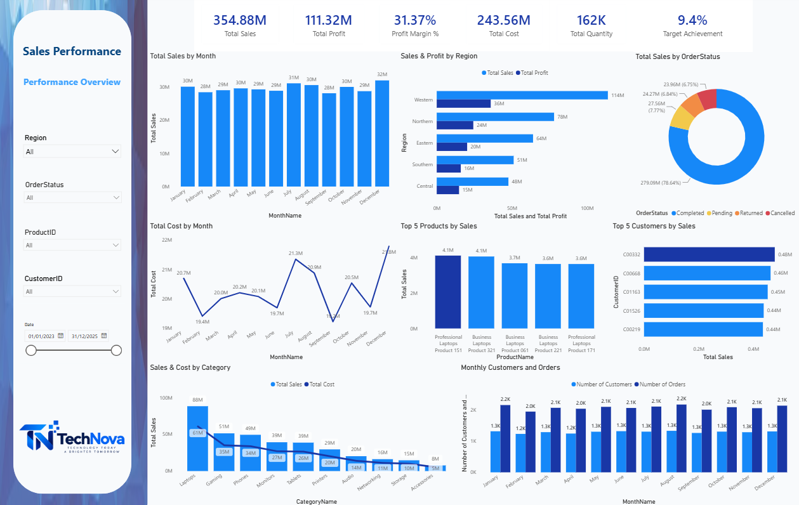

# Sales Performance Dashboard

An interactive Power BI dashboard designed to analyze sales performance, profitability, costs, customers, products, inventory, and target achievement.

## Dashboard Preview



## Project Overview

The Sales Performance Dashboard provides an interactive view of business performance across different dimensions, including time, regions, products, customers, stores, and order status.

The dashboard combines business data into a centralized analytical view to help users monitor key performance indicators and identify trends and performance differences.

## Business Objective

The main objective of this project is to provide a clear and interactive reporting solution that helps users:

- Monitor overall sales performance
- Track profitability and costs
- Analyze sales trends over time
- Compare regional performance
- Identify top-performing products
- Identify top customers
- Monitor customer and order activity
- Compare actual sales against targets
- Analyze inventory and stock information

## Key Performance Indicators

The dashboard includes the following KPIs:

| KPI | Description |
|---|---|
| Total Sales | Total sales amount |
| Total Profit | Total profit generated |
| Profit Margin % | Profit as a percentage of total sales |
| Total Cost | Total cost associated with sales |
| Total Quantity | Total quantity sold |
| Number of Customers | Distinct number of customers |
| Number of Orders | Distinct number of orders |
| Sales Target | Defined sales target |
| Sales Target Achievement % | Actual sales compared with the sales target |

## Business Analysis

The dashboard allows users to analyze:

### Sales Performance
Monthly sales trends and overall sales performance.

### Profitability
Total profit, profit margin, and cost trends.

### Regional Performance
Comparison of sales and profit across different regions.

### Product Performance
Identification of the top-performing products based on sales.

### Customer Performance
Identification of the top customers based on their sales contribution.

### Order Analysis
Analysis of order status distribution, including completed, pending, returned, and cancelled orders.

### Target Performance
Comparison between actual sales and predefined sales targets.

### Inventory Analysis
Visibility into inventory quantities, stock status, and reorder levels.

## Interactive Filters

Users can interact with the dashboard using filters such as:

- Region
- Order Status
- Product
- Customer
- Date

These filters allow users to focus on specific business areas and perform more detailed analysis.

## Data Model

The project uses a relational Power BI data model containing transactional and supporting tables.

Main tables include:

- Sales
- Customers
- Products
- Categories
- Inventory
- Stores
- Suppliers
- ProductSupplier
- Date
- Month
- Targets

The `Sales` table acts as the primary transactional table, while supporting tables provide additional business dimensions for analysis.

Detailed relationships and the complete data model are documented in:

**[Data Model Documentation](Data%20Model/data-model.md)**

## Data Preparation

The source data was provided in Excel format and prepared for analysis using Power Query.

The preparation process included:

- Reviewing source datasets
- Cleaning and organizing data
- Preparing appropriate data types
- Structuring tables for analysis
- Preparing relationships between tables

## DAX Measures

DAX measures were created to calculate the main business KPIs and analytical metrics used throughout the dashboard.

The measures include:

- Total Sales
- Total Profit
- Total Cost
- Profit Margin %
- Total Quantity
- Number of Customers
- Number of Orders
- Profit Target
- Sales Target
- Sales Target Achievement %

Detailed DAX calculations are available in:

**[DAX Measures](DAX/measures.md)**

## Documentation

Additional project documentation is available in:

**[Dashboard Documentation](Documentation/dashboard-documentation.md)**

The documentation covers:

- Business objectives
- Business requirements
- KPIs
- Dashboard components
- Filters
- Data sources
- Data preparation
- Data modeling
- Tools and technologies

## Tools & Technologies

- Power BI
- Power Query
- DAX
- Microsoft Excel
- Data Modeling
- Data Visualization
- GitHub

## Repository Structure

```text
sales-performance-dashboard/
│
├── DAX/
│   └── measures.md
│
├── Data Model/
│   ├── Sales_Performance_Data_Model (2).png
│   └── data-model.md
│
├── Data/
│   └── Excel source files
│
├── Documentation/
│   └── dashboard-documentation.md
│
├── Screenshots/
│   └── Sales_Performance_Dashboard.png
│
└── README.md
